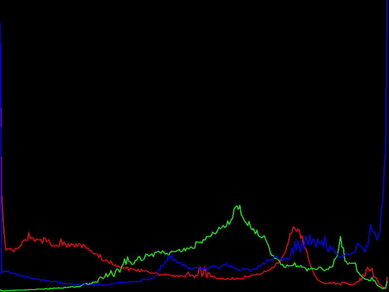

# Taller II: Procesamiento Digital de Imágenes y Gráficos

Repositorio académico de la asignatura **Taller II** de la Universidad Central del Ecuador. El proyecto reúne ejercicios, prácticas, evaluaciones y trabajos grupales desarrollados en Java para estudiar el procesamiento digital de imágenes, el color, la convolución, los histogramas, la composición de imágenes y los fundamentos de gráficos 2D/3D.

La implementación parte del acceso directo a los píxeles mediante `BufferedImage` y evoluciona hacia interfaces gráficas con Swing, convolución separable, ecualización de histogramas, rasterización, Z-Buffer y demostraciones con OpenGL.

## Estado del proyecto

- Compilación verificada con `mvn clean compile`.
- Java 17 como versión objetivo.
- 36 clases Java organizadas por tema.
- Recursos de imagen versionados dentro de `src/main/resources/image/`.
- Salidas generadas para filtros, matrices, histogramas, composición, convolución y prácticas de evaluación.

## Tecnologías

- Java 17
- Maven
- `BufferedImage` e `ImageIO`
- Java AWT y Swing
- FlatLaf para interfaces modernas
- LWJGL 3.3.4 para la demostración OpenGL
- JOGL 2.3.2 para ejercicios de gráficos 3D

## Inicio rápido

Ejecuta los comandos desde la raíz del repositorio:

```bash
mvn clean compile
```

Menú principal de ejercicios:

```bash
java -cp target/classes ec.edu.uce.clases.Imagen
```

Menú de filtros por color:

```bash
java -cp target/classes ec.edu.uce.FiltrosPorColores.Filtros
```

El menú principal contiene 13 ejercicios:

1. Copia de imagen píxel a píxel
2. Imagen aleatoria
3. Degradado vertical 1
4. Degradado vertical invertido
5. Degradado horizontal 1
6. Degradado horizontal 2
7. Degradado radial
8. Escala de grises
9. Filtro negativo
10. Brillo por canal
11. Escala de grises mediante HSV
12. Filtros HSV
13. Canal alpha

El menú de filtros por color contiene:

1. Vidrio esmerilado
2. Desvanecimiento circular
3. Efecto Retro 1 por canales RGB
4. Efecto Retro 2 con dos canales
5. Blanco y negro
6. Escala de grises por niveles

## Funcionalidades implementadas

### Generación de imágenes y color básico

La clase `ec.edu.uce.clases.Imagen` concentra los primeros ejercicios de la materia:

- Copia manual de imágenes.
- Generación de imágenes RGB aleatorias.
- Degradados verticales, horizontales y radiales.
- Escala de grises con luminancia.
- Filtro negativo.
- Ajuste de brillo por canal.
- Conversión a escala de grises usando HSV.
- Transformaciones HSV.
- Manipulación del canal alpha.

Los resultados se guardan principalmente en `src/main/resources/image/`.

### Filtros por color

El paquete `ec.edu.uce.FiltrosPorColores` contiene seis filtros independientes que trabajan sobre `Deber2.jpg`:

- `DesvanecimientoCircular`: controla el alpha según la distancia al centro.
- `EfectoBlancoNegro`: convierte la imagen según luminancia y umbral.
- `EfectoEscalasGrises`: genera versiones con `N = 2, 4, 8, 64, 128, 255` niveles.
- `EfectoRetro1`: cuantiza los canales RGB en varios niveles.
- `EfectoRetro2`: trabaja con las combinaciones RG, RB y GB para cada valor de `N`.
- `VidrioEsmerilado`: genera transparencia variable a partir de la luminancia.

Las salidas se almacenan en `src/main/resources/image/Filtros por Colores/`.

### Convolución y kernels

Las clases de abril documentan la evolución desde la convolución manual hasta el uso de `ConvolveOp`:

- `clase24Abril`: convolución manual con kernel 9x9 y procesamiento independiente de R, G y B.
- `clase27Abril`: convolución mediante `Kernel` y `ConvolveOp`.
- `clase27AbrilFiltros`: filtros por canal rojo, verde y azul.
- `abril27Convolucion.Kernels`: catálogo de kernels normal, enfoque, desenfoque, bordes, aclaración, oscurecimiento, Gaussiano y Laplaciano.
- `Kernels.normalize`: normalización de matrices cuya suma no sea cero.
- `Kernels.scale`: escalamiento de la intensidad de un kernel.

La práctica `ec.edu.uce.clases.pruebas.Prueba1` genera diez imágenes de un efecto tipo amanecer. Mantiene los vecinos del kernel en `0.01` y aumenta progresivamente el valor central, produciendo sumas aproximadas de `0.35` a `1.17`.

```bash
java -cp target/classes ec.edu.uce.clases.pruebas.Prueba1
```

Sus resultados se guardan como `ImagenPrueba_1.png` hasta `ImagenPrueba_10.png` en `src/main/resources/image/Prueba/`.

### Matrices de transformación de color

El paquete `ec.edu.uce.clases.may4MatrizFiltro` implementa transformaciones 4x4 para RGBA. Incluye:

- Escala de grises.
- Sepia.
- Brillo mediante término de desplazamiento.
- Neon Cyberpunk.
- Cinemático Teal & Orange.
- Matrix Verde.
- Retro VHS.
- Vaporwave.
- Hielo Ártico.

La clase `clase4mayo` demuestra la aplicación del efecto VHS sobre `LDU2.jpg` y genera `LDU2_EfectoVHS.png`. Las demás matrices se encuentran disponibles en `Matrices.java` para experimentar con nuevos resultados.

### Histogramas y ecualización

La clase `clase06may` calcula las frecuencias de los valores RGB y genera un gráfico de histograma con los tres canales:

```bash
java -cp target/classes ec.edu.uce.clases.clase06may
```

Salida principal: `src/main/resources/image/Histograma.png`.

El paquete `ec.edu.uce.EcualizadorHistograma` contiene una aplicación Swing más completa:

```bash
java -cp target/classes ec.edu.uce.EcualizadorHistograma.FiltroHistogramaApp
```

La interfaz permite:

- Cargar una imagen desde el sistema.
- Visualizar la imagen original y la procesada.
- Ajustar el brillo con un desplazamiento lineal.
- Convertir opcionalmente a escala de grises.
- Ecualizar mediante la Función de Distribución Acumulada (CDF).
- Comparar el histograma RGB o de luminancia.
- Aplicar zoom a las vistas.
- Guardar el resultado a resolución completa.

### Transparencia, blending y composición

`clase13may` trabaja con tres imágenes, las ajusta a un tamaño común y realiza una mezcla secuencial con alpha `0.5`. El resultado se guarda en `transparencia.png`.

También se incluyen prácticas de composición en `ejerciciospropuestos`:

- `G5Ejercicio`: combinación de fondo y textura con Z-Buffer, Stencil Test y Alpha Test.
- `G6Fragmentos`: máscara rectangular, Stencil, Blending y operación lógica XOR.
- `Grupo2`: práctica adicional de blending con rutas de evaluación.

### Trabajo grupal: operaciones por puntos

La clase `ec.edu.uce.clases.trabajogrupal8jul.App` ejecuta diez operaciones independientes sobre `mundial.jpg`:

1. Aumento del canal rojo.
2. Escala de grises por luminancia.
3. Umbralización con tres valores.
4. Modificación de saturación.
5. Rotación del Hue.
6. Ajuste de brillo positivo y negativo.
7. Interpolación hacia blanco.
8. Interpolación hacia negro.
9. Alto contraste.
10. Conversión y muestra de valores RGB a CMYK.

```bash
java -cp target/classes ec.edu.uce.clases.trabajogrupal8jul.App
```

Las imágenes se generan en `src/main/resources/image/Trabajo Grupal_Operacion_Puntos/`.

### Convolución separable y evaluaciones

La clase `clase13julio` implementa una convolución separable Gaussiana usando el kernel unidimensional `[1/4, 2/4, 1/4]`, aplicado horizontal y verticalmente durante cinco iteraciones:

```bash
java -cp target/classes ec.edu.uce.clases.clase13julio
```

Salida: `FiltroSeparable.png`.

Las clases de `ec.edu.uce.clases.pruebas` incluyen:

- `Prueba2`: realce de bordes aplicado al canal verde con un kernel 3x3.
- `CorreccionEvaluacionSumativa1`: kernel sharpen 5x5 aplicado al canal verde; acepta el número de repeticiones como argumento.
- `EvaluacionSumativaFinal`: convolución separable con kernel de bordes `[-0.5, 2.0, -0.5]`, aplicada horizontal y verticalmente.

```bash
java -cp target/classes ec.edu.uce.clases.pruebas.Prueba2
java -cp target/classes ec.edu.uce.clases.pruebas.CorreccionEvaluacionSumativa1 1
java -cp target/classes ec.edu.uce.clases.pruebas.EvaluacionSumativaFinal
```

### Rasterización, buffers y gráficos 3D

La carpeta `ec.edu.uce.clases.ejerciciospropuestos` reúne ejercicios de fundamentos gráficos:

- `G1ZBuffer`: rasterización de cuadrados, función de borde y Z-Buffer interactivo.
- `G2Capas3D_Java2D`: simulación de capas 3D con profundidad, alpha, tintes RGB, texturas y mapa de profundidad.
- `G2Capas3D`: versión con JOGL y `GLJPanel`, incluyendo profundidad, capas, tintes y texturas.
- `G5Ejercicio`: composición con profundidad, stencil y alpha.
- `G6Fragmentos`: operaciones de fragmentos, stencil, blending y XOR.
- `G7BufferAcumulacion`: simulación de `GL_LOAD`, `GL_MULT` y `GL_RETURN` con distintos factores de iluminación.

El proyecto también contiene una exposición OpenGL en `ec.edu.uce.clases.exposiciones.grupo1`:

- `Main`: ventana GLFW de 800x600 con dos cubos 3D, perspectiva, rotación y prueba de profundidad.
- `ImageProcessor`: conversión de imágenes a escala de grises.
- `TextureLoader`: carga de imágenes como texturas OpenGL.

Para las clases que usan JOGL o LWJGL, ejecútalas desde el IDE con sus dependencias Maven disponibles. En sistemas con configuración de Maven completa también puede utilizarse:

```bash
mvn exec:java -Dexec.mainClass=ec.edu.uce.clases.exposiciones.grupo1.Main -Dexec.classpathScope=runtime
```

Estas demostraciones requieren un entorno de escritorio con soporte gráfico y, en el caso de OpenGL, controladores adecuados.

## Tabla de prácticas ejecutables

| Área | Clase principal | Resultado o propósito |
| --- | --- | --- |
| Menú de imágenes | `ec.edu.uce.clases.Imagen` | Degradados, color, HSV, alpha y generación de imágenes |
| Filtros por color | `ec.edu.uce.FiltrosPorColores.Filtros` | Seis filtros y variantes por niveles |
| Histograma básico | `ec.edu.uce.clases.clase06may` | Histograma RGB en PNG |
| Ecualizador interactivo | `ec.edu.uce.EcualizadorHistograma.FiltroHistogramaApp` | Brillo, escala de grises, CDF, preview y guardado |
| Matrices de color | `ec.edu.uce.clases.may4MatrizFiltro.clase4mayo` | Transformación RGBA mediante matrices |
| Operaciones por puntos | `ec.edu.uce.clases.trabajogrupal8jul.App` | Diez operaciones RGB/HSV/CMYK |
| Convolución manual | `ec.edu.uce.clases.clase24Abril` | Kernel 9x9 por canales |
| Convolución Java | `ec.edu.uce.clases.abril27Convolucion.clase27Abril` | `ConvolveOp` y kernels reutilizables |
| Convolución separable | `ec.edu.uce.clases.clase13julio` | Desenfoque Gaussiano horizontal y vertical |
| Evaluación final | `ec.edu.uce.clases.pruebas.EvaluacionSumativaFinal` | Filtro separable de bordes |
| Rasterización | `ec.edu.uce.clases.ejerciciospropuestos.G1ZBuffer` | Z-Buffer y función de borde |
| OpenGL | `ec.edu.uce.clases.exposiciones.grupo1.Main` | Cubos 3D, perspectiva y profundidad |

## Organización del código

```text
src/
└── main/
    ├── java/ec/edu/uce/
    │   ├── clases/
    │   │   ├── Imagen.java
    │   │   ├── clase20Abril.java
    │   │   ├── clase24Abril.java
    │   │   ├── clase27AbrilFiltros.java
    │   │   ├── clase06may.java
    │   │   ├── clase13may.java
    │   │   ├── clase13julio.java
    │   │   ├── abril27Convolucion/
    │   │   ├── ejerciciospropuestos/
    │   │   ├── exposiciones/grupo1/
    │   │   ├── may4MatrizFiltro/
    │   │   ├── pruebas/
    │   │   └── trabajogrupal8jul/
    │   ├── EcualizadorHistograma/
    │   └── FiltrosPorColores/
    └── resources/image/
        ├── Filtros por Colores/
        ├── Prueba/
        └── Trabajo Grupal_Operacion_Puntos/
```

## Recursos y resultados

El repositorio conserva las imágenes de entrada y los resultados para facilitar la revisión visual de cada práctica. Algunos resultados destacados:

<p align="center">
  
  
  
  
</p>

Las salidas se sobrescriben al ejecutar nuevamente los programas correspondientes. Los nombres de archivo documentan el efecto, el canal, el nivel o el factor utilizado.

## Consideraciones de ejecución

- Ejecuta los comandos desde la raíz del repositorio para que funcionen las rutas relativas a `src/main/resources/image/`.
- `mvn clean compile` compila el proyecto completo y copia los recursos a `target/classes`.
- Las aplicaciones Swing necesitan un entorno de escritorio.
- Las prácticas JOGL/LWJGL necesitan sus dependencias Maven y un contexto gráfico compatible.
- Algunas clases históricas, como `clase13may_profesor` y `Grupo2`, conservan rutas de ejercicios anteriores (`imagenes/` o `src/prueba/`) y requieren esos recursos externos para ejecutarse.
- `target/`, archivos compilados y archivos de IDE están excluidos mediante `.gitignore`; las imágenes de `resources` sí se mantienen versionadas.

## Información académica

| Campo | Información |
| --- | --- |
| Materia | Taller II |
| Institución | Universidad Central del Ecuador |
| Carrera | Ingeniería en Computación |
| Autor | Diego Andrés Borja Simbaña |
| Grupo | Incluye prácticas individuales, grupales y exposiciones |

## Licencia y propósito

Repositorio educativo para documentar el aprendizaje y las prácticas de la asignatura. El código y las imágenes se mantienen con fines académicos y de demostración.
